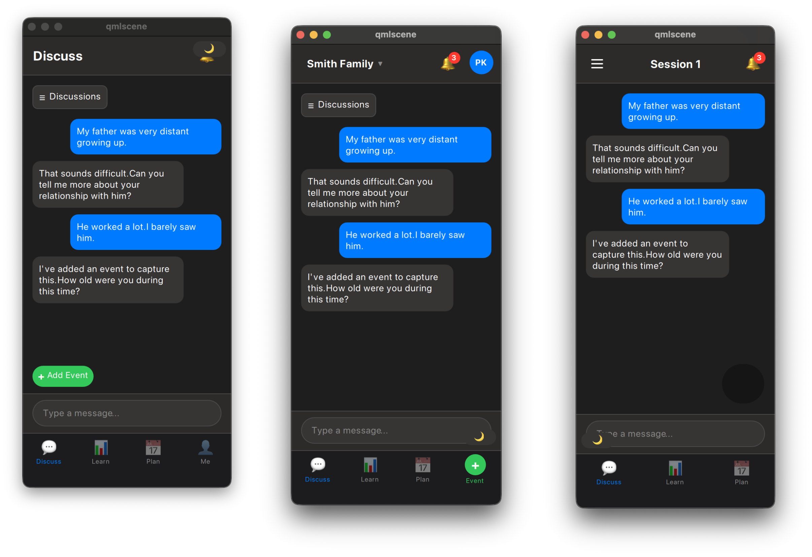
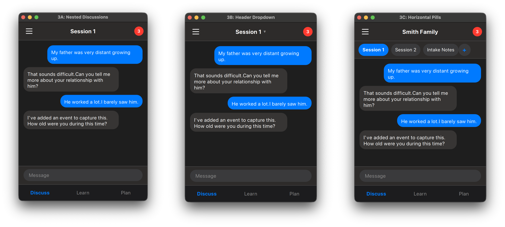
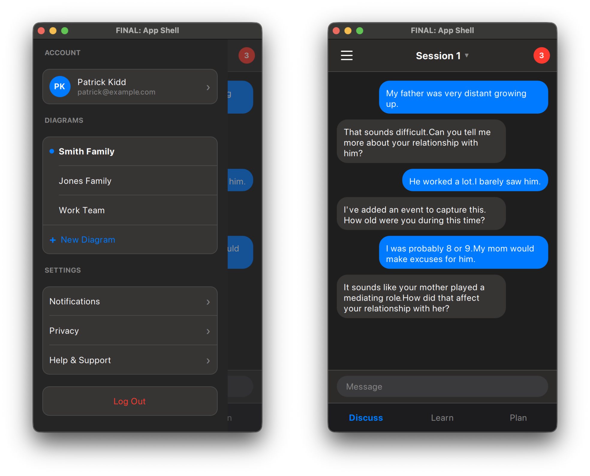

# Agentic Graphical Mockups: AI-Driven UI Prototyping for Production Code

## Abstract

This paper documents a methodology for producing ready-to-code mobile UI mockups through iterative collaboration between a human designer and an AI agent. By using QML as both the prototyping and production language, the process eliminates the traditional handoff gap between design tools and implementation. The methodology was validated through the development of a mobile app navigation system, progressing from problem statement to final implementation-ready code in three iteration cycles.

## 1. Introduction

### 1.1 The Design-to-Code Gap

Traditional UI/UX workflows suffer from a fundamental discontinuity: designers produce static mockups in tools like Figma or Sketch, which developers must then reinterpret into code. This translation introduces:

- **Fidelity loss**: Subtle spacing, timing, and interaction details are lost or approximated
- **Iteration friction**: Design changes require re-translation, slowing feedback loops
- **Specification ambiguity**: Static images cannot fully capture state transitions, edge cases, or responsive behavior

### 1.2 The Time Cost of Traditional Workflows

Industry benchmarks reveal the cumulative cost of the design-development handoff:

**Designer-Developer Iteration Cycles**

| Activity | Typical Duration | Notes |
|----------|------------------|-------|
| Initial mockup creation | 2-5 days | Depending on complexity |
| Developer review & questions | 1-2 days | Async communication overhead |
| Design revision per round | 1-2 days | Designer context-switches back |
| Stakeholder review scheduling | 2-5 days | Calendar availability |
| **Total per iteration cycle** | **1-2 weeks** | Often 3-5 cycles needed |

A typical feature requiring 4 design iterations spans **4-8 weeks** of elapsed calendar time before code begins.

**Mockup-to-Code Conversion**

Once designs are approved, implementation introduces additional delays:

| Phase | Duration | Failure Modes |
|-------|----------|---------------|
| Developer interprets mockups | 2-4 hours | Ambiguity in specs |
| Initial implementation | 1-3 days | Per screen/component |
| Design review of implementation | 1-2 days | "That's not quite right" |
| Pixel-pushing adjustments | 0.5-2 days | Per round of feedback |
| Edge case discovery | 1-3 days | States not in mockups |
| **Total conversion time** | **1-2 weeks** | Per major screen |

**The Hidden Multiplier: Async Communication**

The calendar time dwarfs the actual work time because:

1. **Context switching**: Both designer and developer juggle multiple projects
2. **Timezone gaps**: Distributed teams lose hours per exchange
3. **Meeting overhead**: Synchronous reviews require scheduling
4. **Rework loops**: Misinterpretations discovered late require backtracking

A 2019 study by InVision found that design-to-development handoff consumes **25-50% of total feature development time** in organizations without mature design systems.

### 1.3 The Agentic Approach

An AI agent with access to a declarative UI framework (QML) can produce *executable* mockups that:

1. Run as native applications with real interactions
2. Serve directly as implementation reference or starting code
3. Enable rapid A/B comparison of design variants
4. Preserve complete state and animation specifications

This paper describes the methodology, tooling, and artifacts produced during a real prototyping engagement.

## 2. Methodology

### 2.1 Process Overview

```
┌─────────────────────────────────────────────────────────────────┐
│  ITERATION CYCLE                                                │
│                                                                 │
│  ┌──────────┐    ┌──────────┐    ┌──────────┐    ┌──────────┐  │
│  │ Problem  │───▶│ Research │───▶│ Variants │───▶│  Review  │  │
│  │Statement │    │ Patterns │    │  (A,B,C) │    │ & Select │  │
│  └──────────┘    └──────────┘    └──────────┘    └──────────┘  │
│       │                                               │         │
│       │              ┌────────────────────────────────┘         │
│       │              ▼                                          │
│       │         ┌──────────┐                                    │
│       └────────▶│  Refine  │──────▶ [Next Iteration]            │
│                 └──────────┘                                    │
└─────────────────────────────────────────────────────────────────┘
                           │
                           ▼
                    ┌─────────────┐
                    │ FINAL.qml   │
                    │ + Spec Doc  │
                    └─────────────┘
```

### 2.2 Artifacts Per Iteration

Each iteration produces:

| Artifact | Format | Purpose |
|----------|--------|---------|
| Storyboard | Markdown | Problem statement, pattern research, component mapping |
| Variant files | `{n}-{feature}-{A,B,C}.qml` | Runnable prototypes for comparison |
| Screenshots | WebP images | Visual record for async review |
| Combined view | Side-by-side composite | Direct A/B/C comparison |

### 2.3 File Naming Convention

```
doc/ui-prototyping/{N}-{Feature-Name}/
├── 1-{feature}-storyboard.md      # Problem + research
├── 1-{feature}-A.qml              # First iteration, variant A
├── 1-{feature}-B.qml              # First iteration, variant B
├── 1-{feature}-C.qml              # First iteration, variant C
├── 2-{feature}-A.qml              # Second iteration (refined)
├── 3-{feature}-A.qml              # Third iteration
├── FINAL-{feature}.qml            # Approved design
└── screenshots/
    ├── 1-{feature}-A.webp
    ├── 1-{feature}-combined.webp
    └── FINAL-{feature}-combined.webp
```

This convention ensures:
- **Chronological traceability**: Iteration number prefix orders files naturally
- **Variant comparison**: A/B/C suffix groups contemporaneous alternatives
- **No overwriting**: Each iteration creates new files, preserving design history

## 3. Case Study: App Navigation Shell

### 3.1 Problem Statement

The existing mobile app had navigation elements scattered across multiple UI layers:

| Element | Location | Issue |
|---------|----------|-------|
| Logout button | View header | Conflicts with other controls |
| Add Event | Header right | Overlaps with badge |
| PDP badge | Fixed top-right | Fragile positioning |
| Diagram selector | None | Missing entirely |
| Discussions | Modal drawer | Limited discoverability |

### 3.2 Pattern Research

The agent researched established mobile navigation patterns:

**Pattern 1: Tab Bar with Profile Tab** (Instagram, Twitter/X)
- Dedicated "Me" tab for account functions
- Clear separation of navigation concerns
- Uses tab bar real estate for non-content

**Pattern 2: Header Workspace Switcher** (Slack, Discord)
- Document/workspace dropdown in header
- Avatar provides account access
- More complex header structure

**Pattern 3: FAB + Contextual Header** (Material Design)
- Floating action button for primary action
- Clean header changes per context
- Less native on iOS

**Pattern 4: Contextual Sheets** (Apple Maps, Files)
- Draggable sheets for exploration
- Natural for document selection
- Takes over screen

### 3.3 Iteration 1: Three Variants

The first iteration produced three distinct approaches, each implemented as a runnable QML prototype:

| Variant | Pattern | Source |
|---------|---------|--------|
| A | Profile Tab | [1-app-shell-A.qml](../ui-prototyping/2-App-Navigation/1-app-shell-A.qml) |
| B | Header Workspace Switcher | [1-app-shell-B.qml](../ui-prototyping/2-App-Navigation/1-app-shell-B.qml) |
| C | Hamburger + FAB | [1-app-shell-C.qml](../ui-prototyping/2-App-Navigation/1-app-shell-C.qml) |


*Figure 1: Variants A (Profile Tab), B (Header Switcher), and C (Hamburger+FAB) running simultaneously via qmlscene. Each window title identifies the variant.*

**Variant A: Profile Tab Pattern**
- 4 tabs including dedicated "Me" tab for account/settings
- Emoji icons in tab bar
- PDP badge as notification bell

**Variant B: Header Workspace Switcher**
- Diagram picker dropdown in header
- Avatar for account access
- Add button integrated into tab bar

**Variant C: Hamburger + FAB**
- Left drawer for navigation
- Floating action button for primary action
- Clean 3-tab layout

### 3.4 User Feedback and Refinement

After reviewing the three variants side-by-side (via qmlscene), the stakeholder provided directional feedback:

> "I like the hamburger drawer from C, but the text-only tabs feel cleaner. The emoji icons in A look dated."

This feedback drove Iteration 2, which combined:
- Hamburger menu opening a left drawer (from C)
- Text-only tab bar labels (refined from A)
- iOS-native chat bubble styling
- Flat red PDP badge (simplified from bell icon)

### 3.5 Iteration 3: Discussion Switching

A secondary UX problem emerged: how to switch between discussions within a diagram. Three sub-variants were tested:

| Variant | Approach | Source |
|---------|----------|--------|
| 3A | Nested in Drawer | [3-discussions-A.qml](../ui-prototyping/2-App-Navigation/3-discussions-A.qml) |
| 3B | Header Dropdown | [3-discussions-B.qml](../ui-prototyping/2-App-Navigation/3-discussions-B.qml) |
| 3C | Horizontal Pills | [3-discussions-C.qml](../ui-prototyping/2-App-Navigation/3-discussions-C.qml) |


*Figure 2: Three approaches to discussion switching—nested hierarchy (A), header dropdown (B), and horizontal pills (C).*

**3A: Nested in Drawer**
- Discussions appear indented under their parent diagram
- Expandable/collapsible hierarchy
- Pro: Clear data model representation
- Con: Deep drawer scrolling

**3B: Header Dropdown**
- Tapping discussion title opens dropdown menu
- Diagram shown as context label
- Pro: Quick access without drawer
- Con: Additional tap target to learn

**3C: Horizontal Pills**
- Discussion tabs below header as scrollable pills
- Always visible when on Discuss tab
- Pro: Single-tap switching
- Con: Consumes vertical space

### 3.6 Final Design

The approved design combined elements from multiple iterations. The complete implementation is available at [FINAL-app-shell.qml](../ui-prototyping/2-App-Navigation/FINAL-app-shell.qml).


*Figure 3: The final design showing the left drawer (account, diagrams, settings) and main chat view with header dropdown for discussion switching.*

**Design decisions synthesized from iterations:**

| Element | Source | Rationale |
|---------|--------|-----------|
| Hamburger + Drawer | Variant C | Clean main view, familiar pattern |
| Text-only tab bar | Iteration 2 refinement | Less cluttered than emoji icons |
| Header dropdown | Variant 3B | Quick discussion switching without drawer |
| Flat PDP badge | Iteration 2 refinement | Simpler than bell icon |
| iOS chat bubbles | Iteration 2 | Platform-native feel |

**Key characteristics:**
- **521 lines of QML** - complete, runnable implementation
- **Dark/light mode support** - via property bindings
- **All interactions functional** - drawer, dropdown, tab switching
- **Production color palette** - matches existing app design system

The final QML file can be run directly:

```bash
qmlscene FINAL-app-shell.qml
```

## 4. Technical Implementation

### 4.1 QML as Prototyping Language

QML was chosen for several reasons:

1. **Declarative structure** maps to AI language model strengths
2. **Immediate execution** via `qmlscene` binary
3. **Production target** - prototypes become implementation
4. **State management** built into property bindings
5. **Animation primitives** express timing precisely

### 4.2 Prototype Runner

Prototypes are executed via:

```bash
qmlscene {variant}.qml
```

For multi-variant comparison, multiple instances run simultaneously:

```bash
qmlscene 1-app-shell-A.qml &
qmlscene 1-app-shell-B.qml &
qmlscene 1-app-shell-C.qml &
```

Each window's `title` property identifies the variant for screenshot labeling.

### 4.3 Design System Integration

The prototypes reference the production design system constants:

```qml
// Colors (from production util.py)
property color windowBg: isDarkMode ? "#1e1e1e" : "#f5f5f5"
property color headerBg: isDarkMode ? "#2d2b2a" : "#ffffff"
property color itemBg: isDarkMode ? "#373534" : "#ffffff"
property color borderColor: isDarkMode ? "#4d4c4c" : "#d8d8d8"
property color accentColor: "#007AFF"

// Spacing (from production constants)
// QML_MARGINS: 15, QML_ITEM_HEIGHT: 44, etc.
```

This ensures prototypes render with production-accurate styling.

## 5. Advantages Over Traditional Workflows

### 5.1 Elimination of Handoff

| Traditional | Agentic |
|-------------|---------|
| Figma mockup → Developer interprets | QML prototype IS the implementation |
| "Make it match the design" | "Run FINAL.qml" |
| Redlines and spec documents | Self-documenting code |

### 5.2 Faster Iteration Cycles

The time from feedback to updated prototype:

| Step | Traditional | Agentic |
|------|-------------|---------|
| Interpret feedback | 30 min | Immediate |
| Update mockup | 2-4 hours | 5-15 min |
| Review with stakeholder | Schedule meeting (2-5 days) | Run qmlscene (instant) |
| Document changes | 1 hour | Git diff |
| **Full iteration cycle** | **1-2 weeks** | **< 1 hour** |

**Cumulative Impact**

| Metric | Traditional (4 iterations) | Agentic (4 iterations) |
|--------|---------------------------|------------------------|
| Design iteration time | 4-8 weeks | 2-4 hours |
| Mockup-to-code conversion | 1-2 weeks | 0 (prototype IS code) |
| **Total elapsed time** | **5-10 weeks** | **< 1 day** |

The 50-100x speedup comes from eliminating:
- Async communication latency (days → minutes)
- Meeting scheduling overhead (eliminated)
- Mockup-to-code translation (eliminated entirely)

### 5.3 Complete State Coverage

Static mockups typically show 1-3 states. QML prototypes capture:

- All interactive states (hover, pressed, selected)
- State transitions and animations
- Error states and edge cases
- Responsive behavior at different sizes

## 6. Limitations and Mitigations

### 6.1 Platform Fidelity

QML renders consistently but not identically to native iOS/Android. Mitigation: Use platform-agnostic styling that approximates native feel.

### 6.2 Asset Pipeline

Production apps require image assets, icons, and fonts. Mitigation: Prototypes use emoji placeholders; final implementation substitutes real assets.

### 6.3 Agent Skill Requirements

The AI agent must understand:
- QML syntax and best practices
- Mobile UI/UX conventions
- The target design system

Mitigation: Detailed system prompts with design system documentation.

## 7. Artifacts Produced

The App Navigation Shell engagement produced:

| Category | Count | Lines of Code |
|----------|-------|---------------|
| QML prototypes | 10 files | ~4,500 LOC |
| Screenshots | 12 images | - |
| Storyboard docs | 1 file | 260 lines |
| Final deliverable | 1 file | 521 LOC |

Total elapsed time: 3 iteration cycles across 2 working sessions.

## 8. Conclusion

Agentic graphical mockups represent a paradigm shift in UI prototyping. By using the production UI framework (QML) as the prototyping medium, and an AI agent as the primary author, the methodology achieves:

1. **Zero-loss design fidelity** - the prototype IS the implementation
2. **Rapid iteration** - minutes instead of hours per cycle
3. **Complete specification** - all states, transitions, and edge cases captured
4. **Design history preservation** - every iteration archived for reference

The approach is particularly well-suited to:
- Mobile app development with QML/Qt
- Teams with limited dedicated design resources
- Projects requiring frequent UI iteration
- Maintaining design system consistency

Future work includes automated visual regression testing against approved prototypes and integration with component library generation.

---

## Appendix A: Running the Prototypes

All source code and artifacts from this case study are available in the repository. Readers can run the prototypes to experience the methodology firsthand.

### Prerequisites

- Qt 5.15+ with QML (provides `qmlscene` binary)
- macOS, Linux, or Windows

### Quick Start

```bash
# Clone the repository
git clone <repo-url>
cd familydiagram/doc/ui-prototyping/2-App-Navigation

# Run the final design
qmlscene FINAL-app-shell.qml

# Compare all Iteration 1 variants side-by-side
qmlscene 1-app-shell-A.qml &
qmlscene 1-app-shell-B.qml &
qmlscene 1-app-shell-C.qml &
```

### Source Files

| File | Description | LOC |
|------|-------------|-----|
| [1-app-shell-storyboard.md](../ui-prototyping/2-App-Navigation/1-app-shell-storyboard.md) | Problem statement and pattern research | 260 |
| [1-app-shell-A.qml](../ui-prototyping/2-App-Navigation/1-app-shell-A.qml) | Iteration 1: Profile Tab pattern | 657 |
| [1-app-shell-B.qml](../ui-prototyping/2-App-Navigation/1-app-shell-B.qml) | Iteration 1: Header Workspace Switcher | 580 |
| [1-app-shell-C.qml](../ui-prototyping/2-App-Navigation/1-app-shell-C.qml) | Iteration 1: Hamburger + FAB | 490 |
| [2-app-shell-A.qml](../ui-prototyping/2-App-Navigation/2-app-shell-A.qml) | Iteration 2: Refined drawer + text tabs | 714 |
| [3-discussions-A.qml](../ui-prototyping/2-App-Navigation/3-discussions-A.qml) | Iteration 3: Nested discussions in drawer | 522 |
| [3-discussions-B.qml](../ui-prototyping/2-App-Navigation/3-discussions-B.qml) | Iteration 3: Header dropdown | 485 |
| [3-discussions-C.qml](../ui-prototyping/2-App-Navigation/3-discussions-C.qml) | Iteration 3: Horizontal pills | 410 |
| [FINAL-app-shell.qml](../ui-prototyping/2-App-Navigation/FINAL-app-shell.qml) | **Approved final design** | 521 |

### Screenshots

Pre-rendered screenshots are available in the `screenshots/` directory for reference without running Qt:

| Screenshot | Shows |
|------------|-------|
| [1-app-shell-combined.webp](../ui-prototyping/2-App-Navigation/screenshots/1-app-shell-combined.webp) | All three Iteration 1 variants |
| [3-discussions-combined.webp](../ui-prototyping/2-App-Navigation/screenshots/3-discussions-combined.webp) | Discussion switching variants |
| [FINAL-app-shell-combined.webp](../ui-prototyping/2-App-Navigation/screenshots/FINAL-app-shell-combined.webp) | Final design with drawer open/closed |

---

## Appendix B: Complete Directory Structure

```
familydiagram/doc/ui-prototyping/2-App-Navigation/
├── 1-app-shell-storyboard.md
├── 1-app-shell-A.qml
├── 1-app-shell-B.qml
├── 1-app-shell-C.qml
├── 2-app-shell-A.qml
├── 3-discussions-A.qml
├── 3-discussions-B.qml
├── 3-discussions-C.qml
├── FINAL-app-shell.qml
└── screenshots/
    ├── 1-app-shell-A.webp
    ├── 1-app-shell-B.webp
    ├── 1-app-shell-C.webp
    ├── 1-app-shell-combined.webp
    ├── 2-app-shell-A.webp
    ├── 3-discussions-A.webp
    ├── 3-discussions-B.webp
    ├── 3-discussions-C.webp
    ├── 3-discussions-combined.webp
    ├── FINAL-app-shell-1.webp
    ├── FINAL-app-shell-2.webp
    └── FINAL-app-shell-combined.webp
```

## Appendix C: Agent System Prompt (Excerpt)

```markdown
You are a UI/UX planning agent for Family Diagram's personal/mobile app.

## Your Responsibilities
1. Analyze user requests for new screens, components, or UI changes
2. Design UI specs following the hybrid Liquid Glass + existing app style
3. Write specs to doc/ui-specs/<feature-name>.md
4. Create todos via TodoWrite for the coding agent to implement
5. Propose examples using QML and run via qmlscene

## Output Format
1. Spec file with layout, components, states, animations
2. TodoWrite items for implementation
3. Prototype source code files in doc/ui-prototyping/

## Design System
[Color palette, spacing system, typography, animation constants...]
```

## Appendix D: Sample Iteration Diff

Iteration 1A → Iteration 2A changes:

```diff
- // Variant A: Profile Tab Pattern
- // Adds a 4th "Me" tab for account, settings, diagram selection
+ // Iteration 2: Hamburger + QtQuick Drawer + Account styling from A
+ // Text-only tabs, iOS chat layout, flat design

- Row {
-     Repeater {
-         model: [
-             { icon: "💬", label: "Discuss" },
-             { icon: "📊", label: "Learn" },
-             { icon: "📅", label: "Plan" },
-             { icon: "👤", label: "Me" }
-         ]
+ Row {
+     Repeater {
+         model: ["Discuss", "Learn", "Plan"]

- Text {
-     text: modelData.icon
-     font.pixelSize: 22
- }
- Text {
-     text: modelData.label
+ Text {
+     text: modelData
+     font.pixelSize: 15
+     font.weight: currentTab === index ? Font.DemiBold : Font.Normal
```
